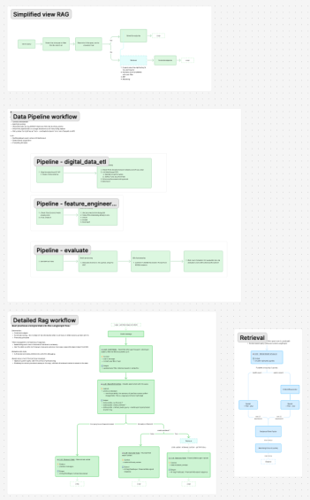

# Financial RAG

> **A Retrieval-Augmented Generation implementation for financial data analysis.**


## 🌟 Features of the Project

### 🧠 RAG Engine & User Experience
A robust RAG (Retrieval-Augmented Generation) system built to parse and understand complex financial reports.
- **Hybrid Retrieval:** Uses **Qdrant** for semantic search and **MongoDB** for metadata filtering.
- **Interactive UX:** A chat-based interface powered by **Gradio** and **LangGraph**, providing real-time feedback on the retrieval process (e.g., "Extracting info...", "Synthesizing answer...").

### 🔄 Production-Ready Pipelines
Developed quality data worflow using **ZenML** pipelines
- **ETL Pipelines:** Automated ingestion of financial documents.
- **Feature Engineering:** Vectorization and indexing workflows.
- **Evaluation:** Continuous assessment of retrieval quality.

### 🎨 Design
Implementation based on a structured design process.
> **[View Figma Workspace](https://www.figma.com/board/769clui85zxQvCIIRHuZsQ/shared-RAG-diagrams?node-id=0-1&t=e9hXxWyYOFi2ogd4-1)**



---

## 🛠 Dependencies & Tech Stack

### Local Dependencies
Essential tools for local development:
- **Git** - Version control system.
- **Python** - Core language (v3.13+).
- **Poetry** - Dependency management.

### Cloud Services
Leveraging modern cloud-native tools for MLOps and storage:
- **🤗 Hugging Face** - Hosts embedding models and datasets.
- **🚀 ZenML** - MLOps framework 
- **🌌 Qdrant** - Vector Database
- **🍃 MongoDB** - NoSQL Database

---

## 📂 Project Structure

```text
Financial_RAG/
├── config/              # Centralized configuration settings
├── domain/              # Core domain logic (NoSQL, VectorDB interfaces)
├── llm_project/         # Application logic (Generation, Retrieval, UX)
├── pipelines/           # ZenML pipeline definitions (ETL, Training, Eval)
├── steps/               # ZenML individual step implementations
├── run/                 # Execution scripts for triggering pipelines
├── pyproject.toml       # Poetry dependency definitions
└── .env                 # Environment variables
```

---

## 🚀 Installation

Follow these steps to set up the project locally.

### 1. Clone the Repository
```bash
git clone <repository-url>
cd Financial_RAG
```

### 2. Setup Python Environment
This project uses **Poetry** for dependency management.

```bash
# Install dependencies
poetry install
```

### 3. Configure Environment Variables
Copy the example environment file and fill in your credentials.

```bash
cp .env.example .env
```

Open `.env` and provide the following keys:
- `MONGODB_HOST` - Your MongoDB connection string.
- `QDRANT_CLOUD_URL` & `QDRANT_APIKEY` - For vector storage.
- `HF_APIKEY` - Hugging Face API key.
- `GEMINI_APIKEY` - Google Gemini API key for generation.

### 4. Running the Project
Start the UI
```bash
poetry run ui
```
To reduce the compute time of the data pipeline, this code only retrieves the first 10 documents. Make sure to check relevant questions in the HF dataset


### 5. Run ZenML Pipelines
```bash
poetry run zenml login --local
poetry run etl
poetry run fe
poetry run eval
poetry run zenml logout 
```